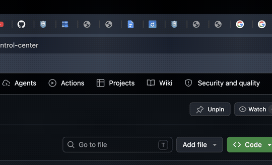

# Notch Control Center

### Turn your MacBook notch into a live control center

Native **macOS** app · **Swift + SwiftUI** · Menu bar utility · **MIT licensed**

[](https://github.com/tigeromp/notch-control-center/releases/latest)
[](https://github.com/tigeromp/notch-control-center)
[](https://github.com/tigeromp/notch-control-center)
[](LICENSE)



**Music · Live stocks · Live sports · Weather · News · Calendar · Timer · Crypto**

---

## Why this exists

MacBooks have a notch — this uses that space for something useful: a **Control Center-style panel** with real-time widgets, gestures, and a clean glass UI.

**vs other notch apps:** focused on **live data** (stocks flash green/red, sports scores update every 2s) plus music and customizable appearance — all open source.

## Quick start

```bash
# Download from Releases (easiest)
open https://github.com/tigeromp/notch-control-center/releases/latest

# Or build from source
git clone https://github.com/tigeromp/notch-control-center.git
cd notch-control-center
bash scripts/run.sh
```

Look for the **music-note icon** in your menu bar.

## Features

### Panel & controls
- Floating panel anchored to the notch / top-center of the screen
- **Three-finger swipe down** to open when collapsed
- Move cursor away, **Esc**, click notch, or **↑** to close
- Customizable **appearance** (text size, colors, accent, panel opacity)

### Widgets (toggle in ⚙ settings)
| Widget | Description |
|--------|-------------|
| **Music** | Apple Music + Spotify — artwork, play/pause, skip, progress |
| **Stocks** | Live watchlist with green/red flash on price changes |
| **Crypto** | BTC, ETH, and more |
| **Sports** | **Live games only** — NFL, NBA, MLB, NHL, soccer, cricket, NCAA |
| **News** | Headlines matched to your weather region |
| **Weather** | Current conditions |
| **Calendar** | Today's events |
| **Timer** | Stopwatch and custom timers |
| **Meeting mode** | Next meeting + quick join |

### Live updates
- Stocks & sports refresh every **2 seconds**
- Colored flash on changes (green/red stocks, accent color for games)
- Keep panel **expanded** to see flashes; data updates in background when collapsed

## Permissions

| Permission | Why |
|------------|-----|
| **Accessibility** | Three-finger swipe to open |
| **Automation** | Spotify control |
| **Calendar** | Events widget |

**System Settings → Privacy & Security**

## Usage

| Action | How |
|--------|-----|
| Open | Three-finger swipe **down** (when collapsed) |
| Close | Mouse away · **Esc** · click notch · **↑** |
| Settings | **⚙** in panel |
| Quit | Menu bar icon → Quit |

## Requirements

- macOS **14 Sonoma** or later
- MacBook with notch recommended

## Developers

```bash
bash scripts/release.sh 1.0.0          # build release zip
bash scripts/publish-github.sh 1.0.0   # push + GitHub release
bash scripts/capture-demo.sh           # record README GIF
```

## Star history

If this project helps you, a ⭐ on GitHub helps others find it!

## License

MIT — [Om Popat](https://github.com/tigeromp) · use freely with attribution.

## Author

**Om Popat** — [@tigeromp](https://github.com/tigeromp)
